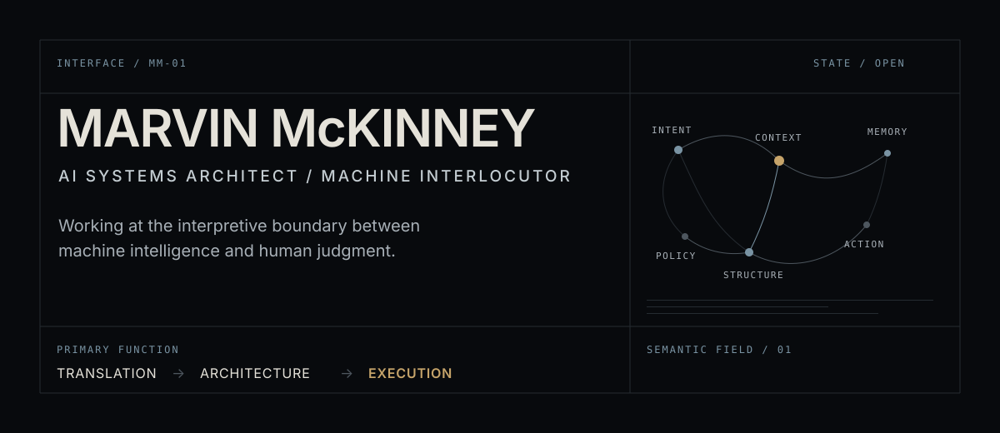

  

# Marvin McKinney

**AI systems architect · Machine interlocutor**

  <a href="https://marvinmckinneyii0.github.io/marvinmckinneyii0/">Enter Interactive Interface</a>
  &nbsp;·&nbsp;
  <a href="https://www.savvyanalytics.info">Savvy Analytics</a>
  &nbsp;·&nbsp;
  <a href="https://www.linkedin.com/in/marvin-mckinneyii/">LinkedIn</a>
  &nbsp;·&nbsp;
  <a href="https://github.com/marvinmckinneyii0">GitHub</a>
  &nbsp;·&nbsp;
  <a href="./Marvin%20McKinney%20Resume%202025.pdf">Résumé</a>

---

## `01` — Interface

I work at the boundary between artificial intelligence, business systems, data, and human judgment.

I design operating systems for AI-native organizations—giving intelligent agents the context, structure, policy, and meaningful work required to become dependable parts of an organization.

Sometimes called an **AI whisperer**. More precisely: I interpret, architect, and orchestrate intelligent systems.

|  |  |
|:--|:--|
| **INTERFACE STATUS** | Open to strategic conversations |
| **CURRENT SIGNAL** | AI-native business operations |
| **PRIMARY FUNCTION** | Translation → architecture → execution |
| **OPERATING MODE** | Strategy / systems / implementation |
| **ORGANIZATIONAL ROLE** | Principal Consultant · Savvy Analytics |

> The objective is not more AI. It is a clearer relationship between machine capability, organizational intent, and accountable action.

---

## `02` — Interpretation Layer

Organizations rarely arrive with a clean technical problem. They arrive with fragmented processes, uneven data, competing priorities, and an incomplete picture of what intelligent systems should be allowed to do.

My work is to resolve that ambiguity into systems that people can understand, govern, and use:

| Layer | Function |
|:--|:--|
| **INTERPRET** | AI strategy, business-process analysis, and executive-to-technical translation |
| **ARCHITECT** | Agent workflows, data systems, knowledge structures, and system boundaries |
| **OPERATIONALIZE** | Automation, integration, implementation oversight, and meaningful agent work |
| **OBSERVE** | Analytics, workflow evaluation, data quality, and responsible system behavior |
| **GOVERN** | Human authority, legibility, policy, and accountable decision paths |

The technical work matters. So does knowing what the system means inside the organization that depends on it.

---

## `03` — Constructed Systems

### Primary systems

#### Savvy Analytics

|  |  |
|:--|:--|
| **SYSTEM** | [Savvy Analytics](https://www.savvyanalytics.info) |
| **FUNCTION** | AI strategy, consulting, and development for SMEs |
| **STATE** | Public practice |
| **ROLE** | Principal Consultant |
| **ARCHITECTURE** | Strategy → systems → implementation |
| **SIGNAL** | Thoughtful, responsible AI transformation |

#### SavvyCortex

|  |  |
|:--|:--|
| **SYSTEM** | SavvyCortex |
| **FUNCTION** | AI-native SaaS system |
| **STATE** | Listed initiative |
| **ROLE** | Systems architect |
| **ARCHITECTURE** | Data, intelligence, and operational workflows |
| **SIGNAL** | Moving AI from isolated capability toward coordinated infrastructure |

### Speculative system

#### WarFox

|  |  |
|:--|:--|
| **SYSTEM** | WarFox |
| **FUNCTION** | Speculative systems design, future technology analysis, and worldbuilding |
| **STATE** | Selected practice |
| **ROLE** | Systems designer / worldbuilder |
| **ARCHITECTURE** | Speculative institutions, future technology, and long-horizon scenarios |
| **SIGNAL** | Using fiction to test relationships between technology, power, continuity, and human judgment |

### Field systems

| Domain | Public work |
|:--|:--|
| **AI agents & retrieval** | [Document Analyzer](https://github.com/marvinmckinneyii0/llm-document-analysis) · [AI Engineering Hub](https://github.com/marvinmckinneyii0/ai_engineering_hub) · [Agentic Dashboard — forthcoming](https://github.com/marvinmckinneyii0/agentic-dashboard) |
| **Data analysis** | [National Emissions Registry Dashboard](https://github.com/marvinmckinneyii0/National-Emissions-Registry-NER-Dashboard) · [Mutual Fund Analysis](https://github.com/marvinmckinneyii0/mutual-fund-analysis) · [ETL Builder — forthcoming](https://github.com/marvinmckinneyii0/etl-builder) |
| **Data engineering** | [ETL Pandas Transformations](https://github.com/marvinmckinneyii0/RTX-Docs) · [Python Projects](https://github.com/marvinmckinneyii0/Marvin-Python-Projects) |
| **Automation** | [Travefy → HubSpot RevOps Workflow](https://github.com/marvinmckinneyii0/n8n_travefy_churn_prediction) · [Attio RevOps Workflow](https://github.com/marvinmckinneyii0/RevOps_Attio_Engagement-) · [MCP + n8n — forthcoming](https://github.com/marvinmckinneyii0/mcp-n8n) |
| **SaaS systems** | FlowIQ · [AI Audit Generator](https://github.com/marvinmckinneyii0/ai-audit-generator) · [SaaS Projects — forthcoming](https://github.com/marvinmckinneyii0/saas_projects) · [AI Cleaner — forthcoming](https://github.com/marvinmckinneyii0/ai-cleaner) |
| **Web interfaces** | [Interview Preparation Project](https://github.com/marvinmckinneyii0/interview_prep_webpage) |

---

## `04` — Machine Vocabulary

Technologies are most useful when described by the function they perform inside a system.

| System anatomy | Working vocabulary |
|:--|:--|
| **REASONING** | Agentic AI systems · retrieval-augmented workflows · document analysis · context design |
| **MEMORY** | SQL · structured data · retrieval workflows · organizational knowledge |
| **PERCEPTION** | Python · Databricks · analytics · data pipelines · signal extraction |
| **ACTION** | FastAPI · Node.js · n8n · APIs · workflow automation · system integration |
| **INFRASTRUCTURE** | Azure · Docker · PostgreSQL · TypeScript · JavaScript |
| **INTERFACE** | React · Vite · decision-oriented data products |
| **OBSERVATION** | Data quality · analytics · workflow evaluation · responsible AI practice |

---

## `05` — Operating Principles

|  |  |
|:--|:--|
| `01` | **Intelligence must produce accountable action.** |
| `02` | **Automation should remove friction, not human agency.** |
| `03` | **An agent without memory is a tool, not a collaborator.** |
| `04` | **Systems should remain legible to the people they affect.** |
| `05` | **The future should feel designed—not merely generated.** |

---

## `06` — Current Signal

STATIC RESEARCH SNAPSHOT · MANUALLY CURATED

- **AI-native business operations** — how agents become reliable participants in real organizational work.
- **Agent orchestration** — coordinating context, responsibilities, tools, and human authority.
- **Organizational intelligence** — turning fragmented data and knowledge into usable institutional memory.
- **Data quality and observability** — making system behavior visible before it becomes consequential.
- **Human-machine decision systems** — designing the boundary between prediction, recommendation, and judgment.

---

## `07` — Contact Protocol

| Intent | Destination |
|:--|:--|
| **INITIATE A STRATEGIC CONVERSATION** | [Savvy Analytics](https://www.savvyanalytics.info) |
| **ACCESS PROFESSIONAL NETWORK** | [LinkedIn — Marvin McKinney](https://www.linkedin.com/in/marvin-mckinneyii/) |
| **VIEW PUBLIC SYSTEMS** | [GitHub — marvinmckinneyii0](https://github.com/marvinmckinneyii0) |
| **REVIEW PROFESSIONAL HISTORY** | [Marvin McKinney résumé](./Marvin%20McKinney%20Resume%202025.pdf) |

---

## Production Continuity

CONSISTENT PUBLIC OUTPUT · LONG-HORIZON PRACTICE

  

---

<strong>Repository telemetry</strong>

 

  

  
  

<strong>Recent public activity</strong>

 

<!--START_SECTION:activity-->
<!-- A GitHub Action may insert recent pull requests, issues, reviews, and comments here. -->
<!--END_SECTION:activity-->

 

  INTERFACE / MM-01 &nbsp;·&nbsp; HUMAN JUDGMENT REMAINS IN THE LOOP

